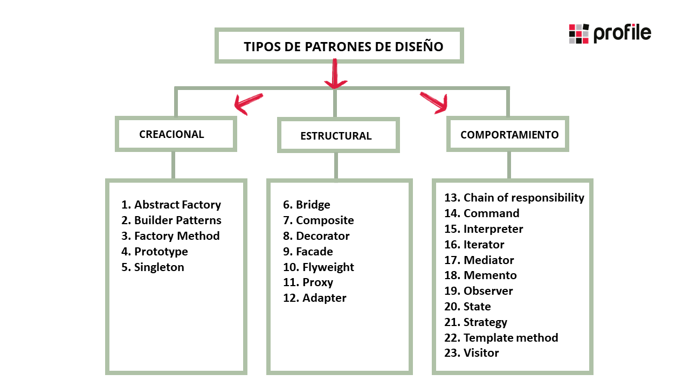
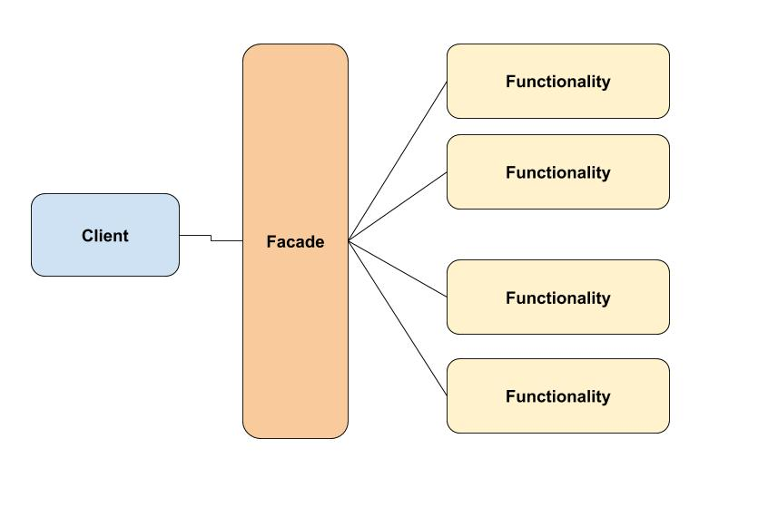

# Patrones de Diseño 
Los patrones de diseño o **design patterns**, son una solución general, reutilizable y aplicable a diferentes problemas de diseño de software. Se trata de plantillas que identifican problemas en el sistema y proporcionan soluciones apropiadas a problemas generales a los que se han enfrentado los desarrolladores durante un largo periodo de tiempo, a través de prueba y error.

# Historia de los patrones de Diseño 
En 1994, cuatro autores Erich Gamma, Richard Helm, Ralph Johnson y John Vlissides, a los que llamaron Gang of Four (GoF), publicaron un libro titulado Design Patterns, elementos de software orientado a objetos reutilizables. Con este trabajo se inició el concepto de patrón de diseño en el desarrollo de software y recoge 23 patrones de diseño comunes. Cada uno de ellos define la solución para resolver un determinado problema, facilitando además la reutilización del código fuente.

## **Tipos de patrones**
 Los patrones de diseño más utilizados se clasifican en tres categorías principales, cada patrón de diseño individual conforma un total de 23 patrones de diseño. Las cuatro categorías principales son:

* Patrones creacionales
* Patrones estructurales
* Patrones de comportamiento

# Facade 
El patrón de diseño **Facade** simplifica la complejidad de un sistema mediante una interfaz mas sencilla. Mejora el acceso a nuestro sistema logrando que otros sistemas o subsistemas usen un punto de acceso en común que reduce la complejidad, minimizando las interacciones y dependencias. De este modo simplifica la complejidad a los clientes externos.

## **Analogía en el mundo real**

Cuando llamas a una tienda para hacer un pedido por teléfono, un operador es tu fachada a todos los servicios y departamentos de la tienda. El operador te proporciona una sencilla interfaz de voz al sistema de pedidos, pasarelas de pago y varios servicios de entrega.

**Ejemplo:**

## Integrantes:
    Maturano Camila
    Pietrobon Cristian